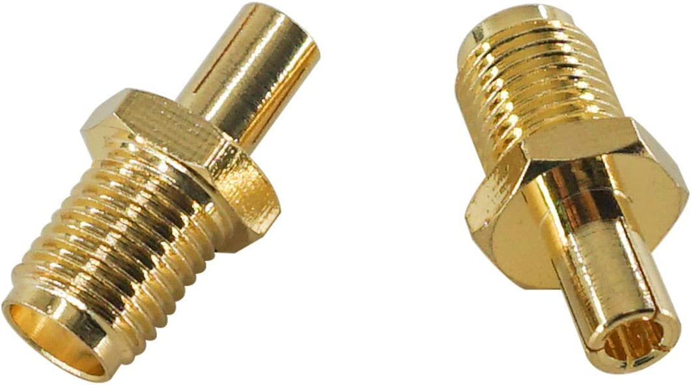

# Wallmount for Netear M5 Mobile 5G Router

## Antenna connectors

This mount includes two holes at the bottom which align with the TS9 antenna connectors.

I recommend to use TS9 to SMA adapters which can be screwed into those holes

### Sources

- [Amazon](https://www.amazon.de/-/en/Antenna-Adapter-Straight-Connector-Broadband/dp/B08RYZ811X)

## Foam padding

The inside of the mount has a clearance of about 1,5mm against each side which can be used for padding the device with foam rubber.
